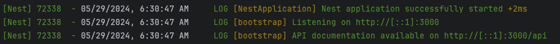

# Chapitre 2 - Configuration ⚙️
&nbsp;

#### Objectif de la Mission 🎯
- Récupérer et démarrer l'API Star Wars
- Installer l'outil Bruno


## Pré-requis

Assurez-vous d'avoir [NodeJS](https://nodejs.org/en/) en version 16 ou supérieure

```shell
node -v # v16+
```

([Cliquer ici pour installer node si besoin](https://nodejs.org/en/download/package-manager))

## Récupération de l'API Star Wars

- Clonez le code source du codelab

```shell
git clone https://github.com/aland404/star-wars-api.git
```

(_Si vous n'avez pas git d'installé vous pouvez également télécharger le dossier sur votre poste_)

- Une fois le projet récupéré sur votre poste, mettez vous à la racine de celui-ci et installez les dépendances

```shell
# selon votre gestionnaire de paquet
npm install
# OR
yarn install
# OR
pnpm install
```

## Démarrage de l'API

```shell
# selon votre gestionnaire de paquet, yarn OR pnpm OR npm
yarn run start
```

Vous devriez voir les logs suivants:



[La documentation de l'API](http://localhost:3000/api#/) est maintenant accessible

## Installation de Bruno

Deux possibilités pour installer Bruno.

- Installation via un gestionnaire de paquets

```shell
## MacOS
# Homebrew
brew install bruno

## Linux
# Snap
snap install bruno
# Apt
sudo mkdir -p /etc/apt/keyrings 
sudo gpg --no-default-keyring --keyring /etc/apt/keyrings/bruno.gpg --keyserver keyserver.ubuntu.com --recv-keys 9FA6017ECABE0266 

echo "deb [signed-by=/etc/apt/keyrings/bruno.gpg] http://debian.usebruno.com/ bruno stable" | sudo tee /etc/apt/sources.list.d/bruno.list 
 
sudo apt update 
sudo apt install bruno

## Windows
# Chocolatey
choco install bruno
# Scoop
scoop bucket add extras
scoop install bruno
```

- Installation via des binaires

Téléchargement sur le site [usebruno](https://www.usebruno.com/downloads)

## Démarrage de Bruno

Démarrez l'application Bruno

Vous devriez voir la page d'accueil de Bruno:

