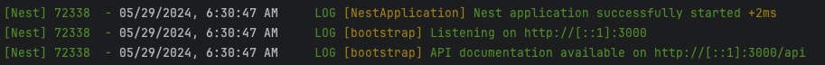
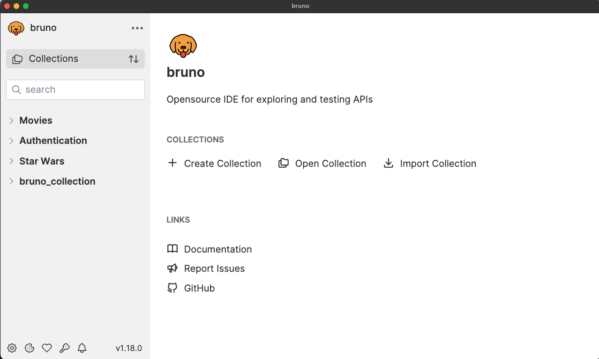

# Chapitre 2 - Configuration ⚙️
&nbsp;

#### Objectifs de la Mission 🎯
- Récupérer et démarrer l'API Star Wars
- Installer l'outil Bruno


## Pré-requis

Assurez-vous d'avoir [NodeJS](https://nodejs.org/en/) en version 16 ou supérieure

:::info
Si vous avez déjà une version antérieure que vous souhaitez conserver, vous pouvez vous tourner vers `nvm` pour gérer plusieurs versions de node facilement sur votre ordinateur.
:::

```shell
node -v # v16+
```

([Cliquer ici pour installer node si besoin](https://nodejs.org/en/download/package-manager))

## Récupération de l'API Star Wars

Deux possibilités ici :

1. Télécharger le binaire de l'API

[Lien de téléchargement](https://raw.githubusercontent.com/aland404/star-wars-api/refs/heads/main/star-wars)

2. Récupérez le repo de l'API

```shell
git clone https://github.com/aland404/star-wars-api.git
```

(_Si vous n'avez pas git d'installé vous pouvez également [télécharger le dossier](https://github.com/aland404/star-wars-api/archive/refs/heads/main.zip) sur votre poste_)

- Une fois le projet récupéré sur votre poste, mettez vous à la racine de celui-ci et installez les dépendances

```shell
# selon votre gestionnaire de paquet
npm install
# OR
yarn install
# OR
pnpm install
```

## Démarrage de l'API

```shell
# selon votre gestionnaire de paquet, yarn OR pnpm OR npm
yarn run start
```

Vous devriez voir les logs suivants:



[La documentation de l'API](http://localhost:3000/api#/) est maintenant accessible en local


::: warning
Attention, les données ne sont persistées que sur la session en cours.

Donc à chaque fois que vous redémarrez votre serveur, elles reviendront à leur état initial.
:::

## Installation de Bruno

Deux possibilités pour installer Bruno.

- Installation classique

Téléchargement sur le site [usebruno](https://www.usebruno.com/downloads)

- Installation via un gestionnaire de paquets

```shell
## MacOS
# Homebrew
brew install bruno

## Linux
# Snap
snap install bruno
# Apt
sudo mkdir -p /etc/apt/keyrings 
sudo gpg --no-default-keyring --keyring /etc/apt/keyrings/bruno.gpg --keyserver keyserver.ubuntu.com --recv-keys 9FA6017ECABE0266 

echo "deb [signed-by=/etc/apt/keyrings/bruno.gpg] http://debian.usebruno.com/ bruno stable" | sudo tee /etc/apt/sources.list.d/bruno.list 
 
sudo apt update 
sudo apt install bruno

## Windows
# Chocolatey
choco install bruno
# Scoop
scoop bucket add extras
scoop install bruno
```

## Démarrage de Bruno

Démarrez l'application Bruno

Vous devriez voir la page d'accueil de Bruno:

