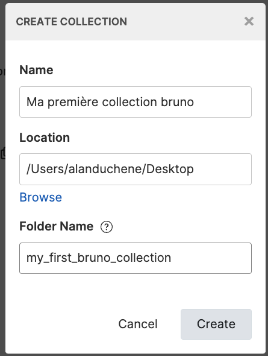

<script setup>
import Wars from '../components/Wars.vue';
import People from '../components/People.vue';
</script>

# Chapitre 3 - Exploration 🛰
&nbsp;

#### Objectif de la Mission 🎯
- Découverte de l'API Star Wars
- Découverte de l'outil Bruno

## Découverte de l'API Star Wars

Parcourez [la documentation de l'API](http://[::1]:3000/api#/)

Cette API permet manipuler les resources (personnages et véhicules) des différentes factions (empire et rébellion).

<People />

Elle permet également de consulter les différentes guerres et batailles qui se déroule en ce moment même dans la galaxie.

<Wars />

## Découverte de Bruno

#### Première collection

Commencez par créer une collection et des requêtes dans celle-ci.

Pour ceci cliquez sur les trois petits points (...) dans la partie supérieure droite du menu de gauche de Bruno, cliquez sur "Create Collection", complétez le formulaire puis cliquez sur le bouton "Create".




À ce stade, vous devriez voir votre collection dans le menu de gauche de Bruno.

::: tip INFO ℹ️
Vous avez peut-être remarqué que vous n'avez pas eu à créer de compte ou à vous connecter en démarrant Bruno.
C'est parce que contrairement à la pluspart des autres outils disponibles dans la galaxie, Bruno est complètement indépendant vis-à-vis du cloud.

Toutes vos requêtes, collections, etc., manipulées seront stockées en local, sur votre poste.
C'est pour cela que lorsque vous allez créer une collection, Bruno vous demandera un chemin pour savoir où la stocker sur votre poste (champ location du formulaire).
:::

#### Première requête

Une fois la collection prête, créez une requête pour lire les information des personnages de la galaxie en requêtant l'api GET: http://localhost:3000/star-wars/people

Pour se faire, cliquez sur les trois petits points (...) à droite du nom de votre collection, cliquez sur "New Request", complétez le formulaire puis cliquez sur le bouton "Create".


Une fenêtre représentant votre requête s'ouvre sur la partie droite.

Éxecutez la requêtes en cliquant sur la flèche à droite de cette nouvelle fenêtre.


Félicitations, vous avez créé votre première requête http avec Bruno 🎉

#### Le Bru language


https://www.brulang.org/

<Solution>

```bru
# .bru file to set in a bru collection folder
# Request to get all the people from the star wars api
meta {
  name: Get all characters
  type: http
  seq: 1
}

get {
  url: {{base_url}}/star-wars/people
  body: none
  auth: none
}
```

</Solution>
