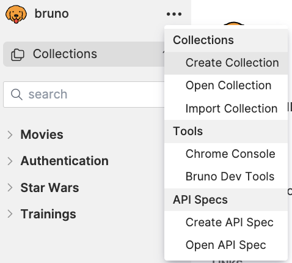
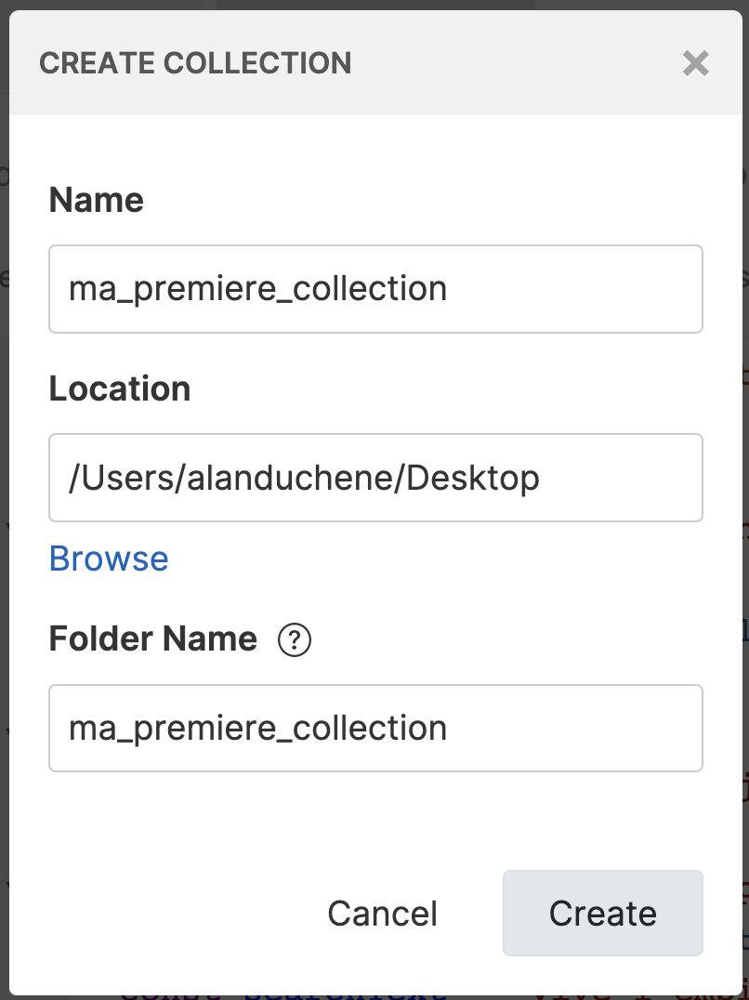
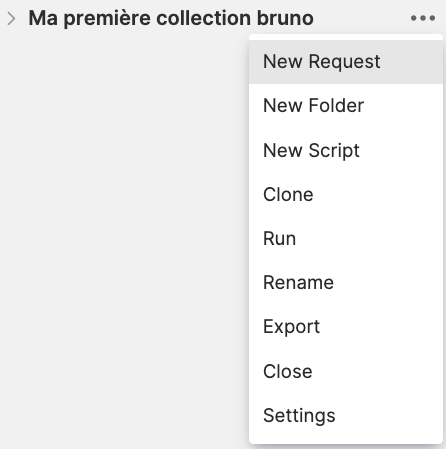
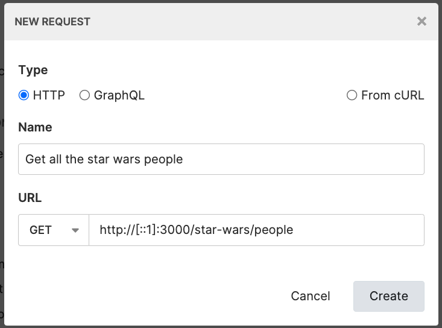
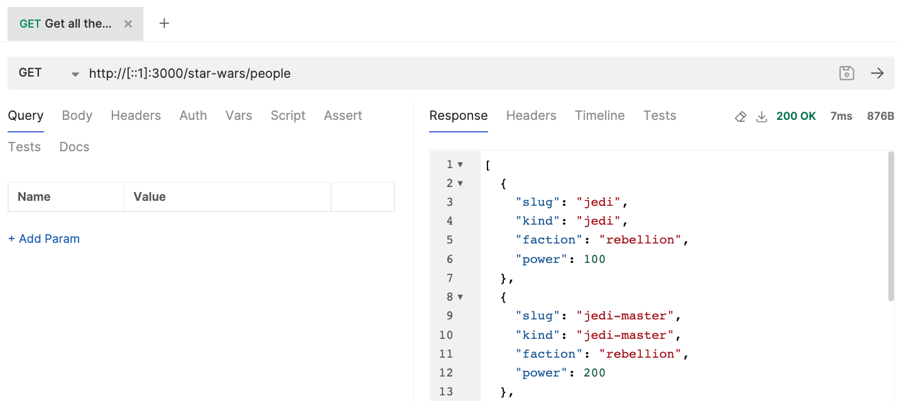
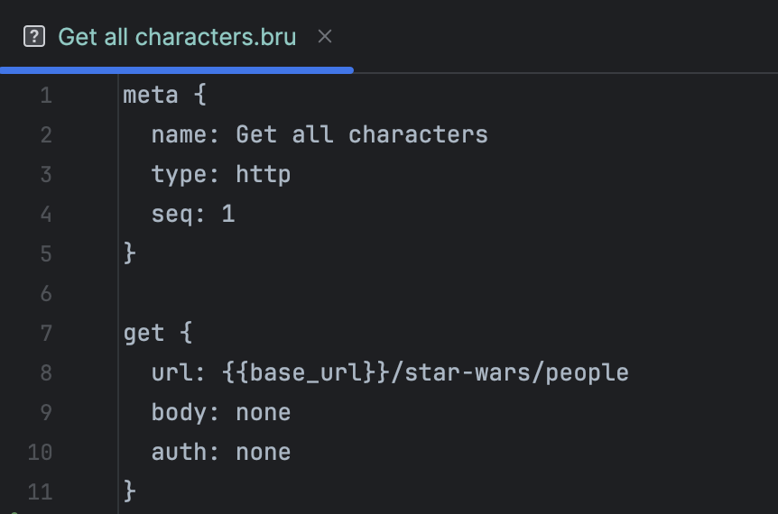
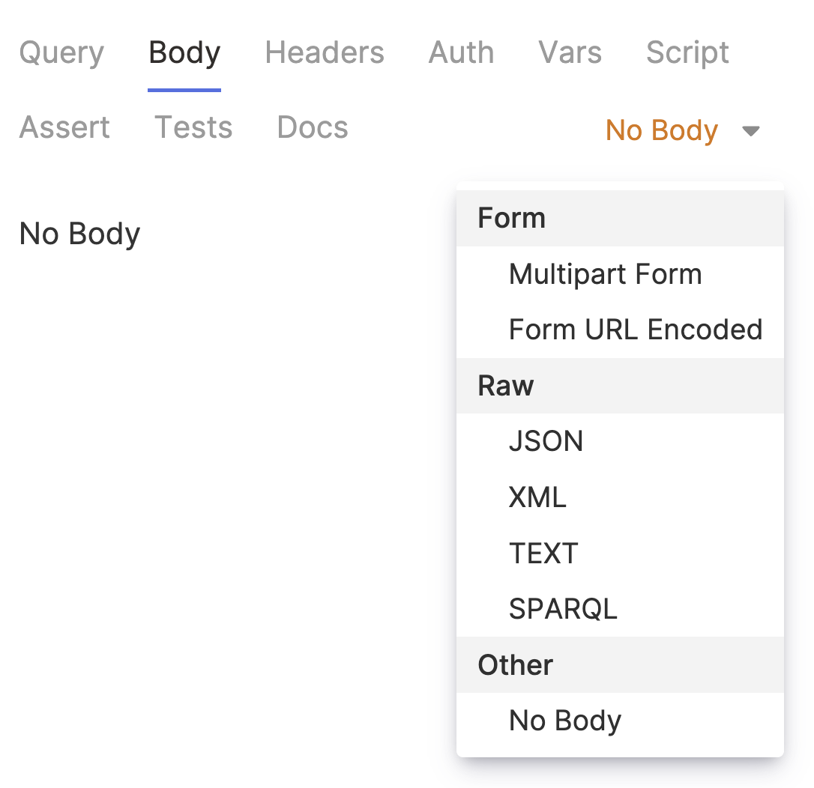

<script setup>
import Wars from '../components/Wars.vue';
import People from '../components/People.vue';
</script>

# Chapitre 3 - Exploration 🛰
&nbsp;

#### Objectifs de la Mission 🎯
- Découvrir l'API Star Wars
- Découvrir de l'outil Bruno

## Découverte de l'API Star Wars

Parcourez [la documentation de l'API](http://localhost:3000/api#/)

Cette API permet de manipuler les types de personnages des différentes factions (empire et rébellion).

<People />

Elle permet également de consulter les différentes guerres et batailles qui se déroulent en ce moment même dans la galaxie.

<Wars />

## Découverte de Bruno

#### Première collection

Commencez par créer une collection (regroupement de requêtes) et des requêtes dans celle-ci.

:::warning Évitez les espaces et caractères spéciaux dans le nommage de votre collection
:::

Pour ceci, cliquez sur les trois petits points (...) dans la partie supérieure droite du menu de gauche de Bruno, cliquez sur `Create Collection`, complétez le formulaire (gardez en tête le chemin que vous choisirez pour sauvegarder votre collection, le champ `Location`) puis cliquez sur le bouton `Create`.




À ce stade, vous devriez voir votre collection dans le menu de gauche de Bruno.

::: info INFO ℹ️
Vous avez peut-être remarqué que vous n'avez pas eu à créer de compte ou à vous connecter en démarrant Bruno.
C'est parce que contrairement à la plupart des autres outils disponibles dans la galaxie, Bruno est complètement indépendant vis-à-vis du cloud.

Toutes vos requêtes, collections, etc., manipulées seront stockées en local, sur votre poste.
C'est pour cela que lorsque vous créez une collection, Bruno vous demande un chemin pour savoir où la stocker sur votre poste (champ `location` du formulaire).
:::

#### Première requête

Une fois la collection prête, créez une requête pour lire les informations des personnages de la galaxie en requêtant l'api `GET`: http://localhost:3000/star-wars/people

Pour se faire, faites un clic droit sur le nom de votre collection ou cliquez sur les trois petits points (...) à droite du nom de celle-ci > cliquez sur `New Request` > complétez le formulaire > cliquez sur le bouton "Create".




Une fenêtre représentant votre requête s'ouvre alors sur la partie droite.

Éxecutez la requête en cliquant sur la flèche à droite de l'URL de cette fenêtre.



___(pensez à sauvegarder au fur et à mesure vos requêtes (ctrl + s ou cmd + s en fonction de votre système d'exploitation))___

Félicitations, vous avez créé votre première requête http avec Bruno 🎉

<br/>

#### Le Bru language

Bruno utilise le langage Bru pour enregistrer les détails d'une requête API dans un fichier.

C'est un langage de balisage simple avec une sémantique de type JSON.

Ouvrez le fichier sur votre ordinateur représentant la requête que vous venez de créer (avec un extension .bru). Il se trouve à l'emplacement où vous avez choisi de sauvegarder votre collection.

Il devrait ressembler à ceci:




Pour plus d'information, consultez la [documentation sur le Bru language](https://www.brulang.org/).

<br/>

#### Organisation par dossier et enrichissement de la collection

Il est possible d'organiser une collection à l'aide de dossiers, pour ceci faites un clic droit sur la collection > cliquez sur `New folder` > complétez le formulaire > cliquez sur `Create`.

Créez quatre dossiers pour les requêtes concernant les types de personnages, les guerres, les batailles et le système d'authentification.

En vous aidant de [la documentation de l'API](http://localhost:3000/api#/) complétez les dossiers en créant de nouvelles requêtes

::: tip Astuce
Pour gagner du temps sur la création de nouvelles requêtes, vous pouvez repartir d'une requête précédente en la clonant (clic droit, "Clone").
:::

- pour les types de personnages
  - voir les types de personnages d'une faction
    - cette requête nécessite un query param, pour ce faire => `http://mon-url?queryParamName=queryParamValue`
  - voir les informations d'un type de personnage
- pour les guerres
  - voir les informations de toutes les guerres
  - voir les informations d'une guerre
  - voir le résumé d'une guerre
- pour les batailles (vous pouvez mettre le dossier dans celui des guerres)
  - voir une bataille
  - voir le résumé d'une bataille
- pour l'authentification
  - récupérer un passport galactique (requête `POST`)

Pour récupérer un passport galactique, vous allez devoir passer un body à votre requête (cf [doc API](http://localhost:3000/api#/auth/AuthController_getGalacticPassport)). 
Pour renseigner le body, cliquez sur l'onglet `Body` dans Bruno, puis sur `No body` et sélection `JSON` dans le menu déroulant qui s'affiche.



Renseignez dans ce body un numéro de matricule (`registrationNumber`) et un mot de passe (`password`).

Pour récupérer ces informations, rdv sur la page ["Mes informations"](personnal-info.html)

<Solution>

```json
{
  "registrationNumber": "7728398-9879870-8765007-42",
  "password": "onlyYouCanSaveTheGalaxy"
}
```

</Solution>

<Solution title="Besoin d'un coup de main ?">

Les solutions à ce chapitre sont dans le dossier [solutions/chapter-3](https://github.com/aland404/workshop-bruno/tree/main/solutions/chapter-3)

</Solution>

À ce stade, vous avez déjà une collection bien remplie, il va maintenant falloir aller plus loin grâce à la gestion des variables d'environnement et des secrets.