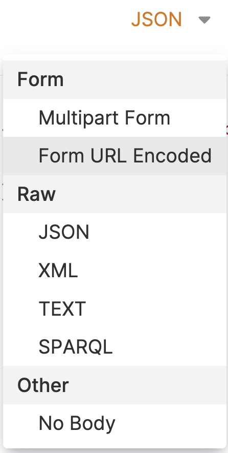
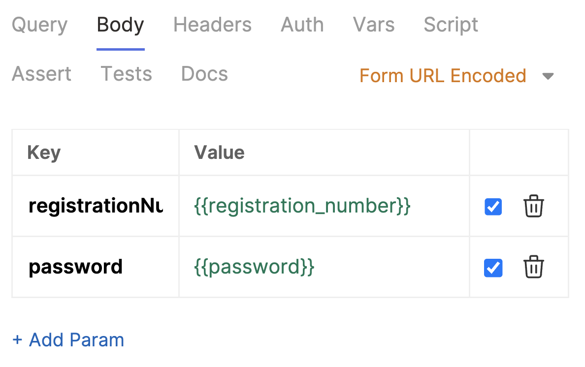

# Chapitre 4 - La force des variables 💪
&nbsp;

#### Objectif de la Mission 🎯
- Découvrir les variables d'environnement
- Découvrir la gestion des secrets

## Les variables d'environnement

Aujourd'hui pour intéragir avec le système centralisé de gestion des personnages et des ressources de la résitance nous utilisons une version accessible en locale.

Imaginons que demain, la résistance décide que l'accès à ces ressources soient impossible en local et se fasse sur différents serveurs en fonction de l'étoile la plus proche à votre position. Il faudrait alors changer toutes les requêtes en mettant à jour nos URLs et ce à chaque fois que l'on changerait de position dans la galaxie.

Pour palier à ce problème, et à n'importe quel problème de répétition d'informations identiques en fonction d'un contexte donné, il est possible de déclarer des variables d'environnement.

#### Créer un nouvel environnement

Cliquez en haut à droite de l'interface de Bruno sur le bouton "No environment", cliquez sur le bouton "Configure" puis sur "Create Environment".
Renseignez un nom pour votre environnement, par exemple "Andor" pour une configuration correspondant à la planète Andor.

Une nouvelle fenêtre s'ouvre, vous pouvez alors ajouter, supprimer et modifier des variables d'environnement.

Ces variables sont, par défaut, visibles pour toutes les personnes ayant accès à la collection, mais vous pouvez définir comme "secrète" une variable sensible en cochant la checkbox correspondante. 

Ajouter des variables pour:
- l'url de base (base_url) de vos appels
- votre numéro de matricule
- votre mot de passe (en tant que variable secrète)
- tout ce que vous trouverez pertinant

Prenez un instant pour examiner le fichier bru représentant votre environnement (<env_name>.bru)

#### Utilisez vos variables d'environnement

Une fois vos variables définies, vous pourrez les utiliser via la syntaxe moustache: &#123;&#123; base_url &#125;&#125;.
Utilisez vos variables dans vos requêtes.

##### Dans vos URLs:

##### Dans le payload de votre requête POST pour récupérer votre passeport galactique:

::: warning Attention
Pour que Bruno interprète des variables dans un body, il faut utiliser un body de type "Form URL Encoded"
:::

Prenez un instant pour examiner le fichier bru de votre requête pour récupérer votre passport galactique.

<Solution title="Besoin d'un coup de main ?">

Les solutions à ce chapitre sont dans les dossiers [solutions/chapter-4](https://github.com/aland404/workshop-bruno/tree/main/solutions/chapter-4) et [solutions/environments](https://github.com/aland404/workshop-bruno/tree/main/solutions/environments)

</Solution>

Nous pouvons aller encore plus loin grâce à la notion de scripts.