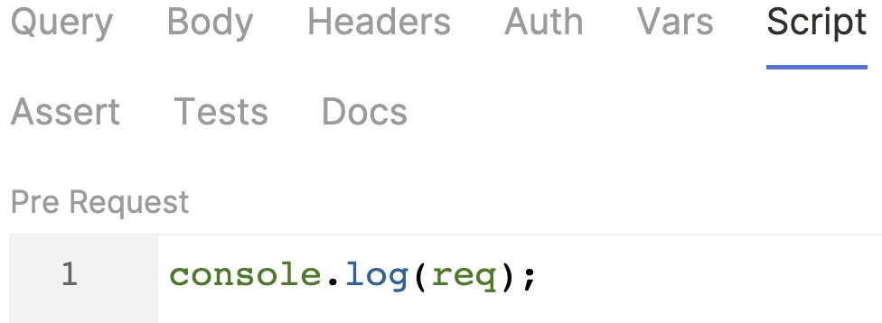
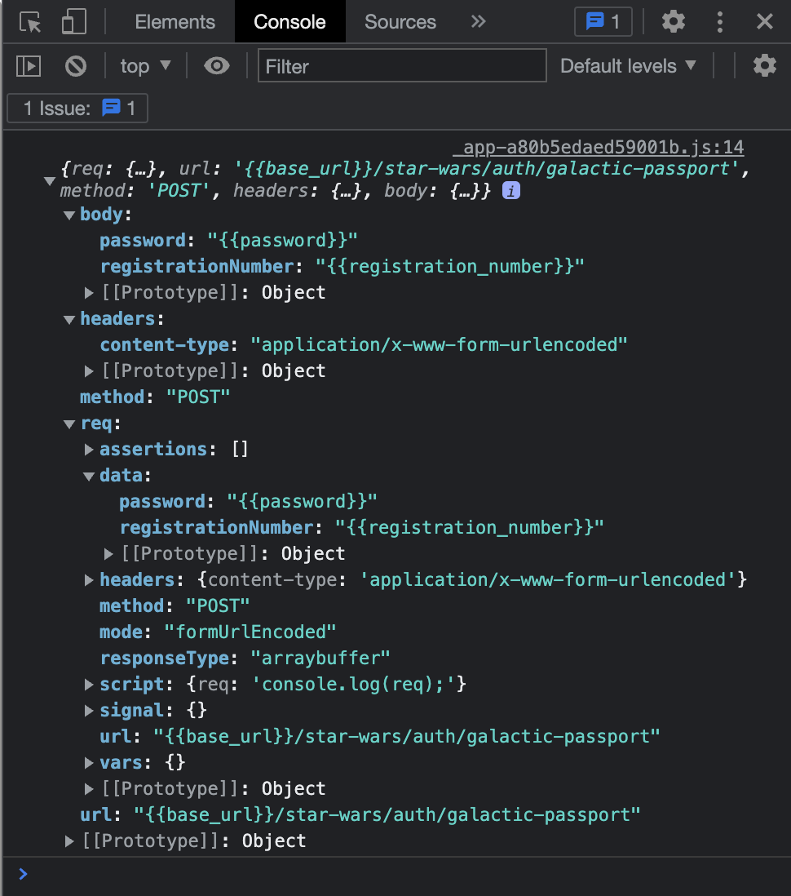
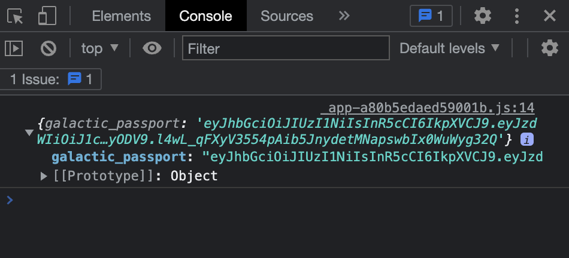
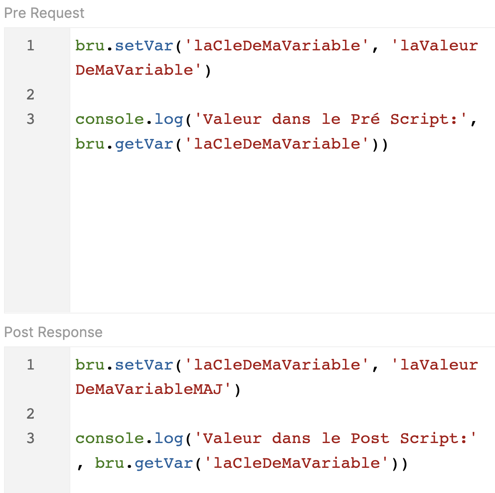
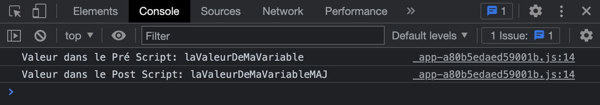
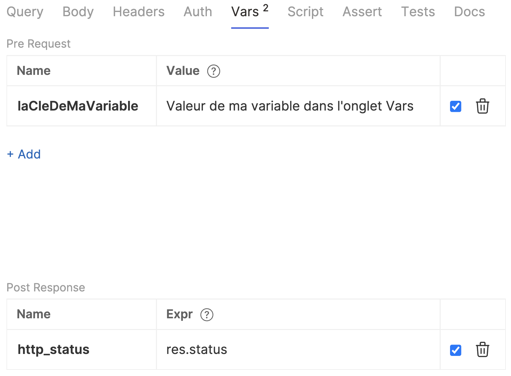
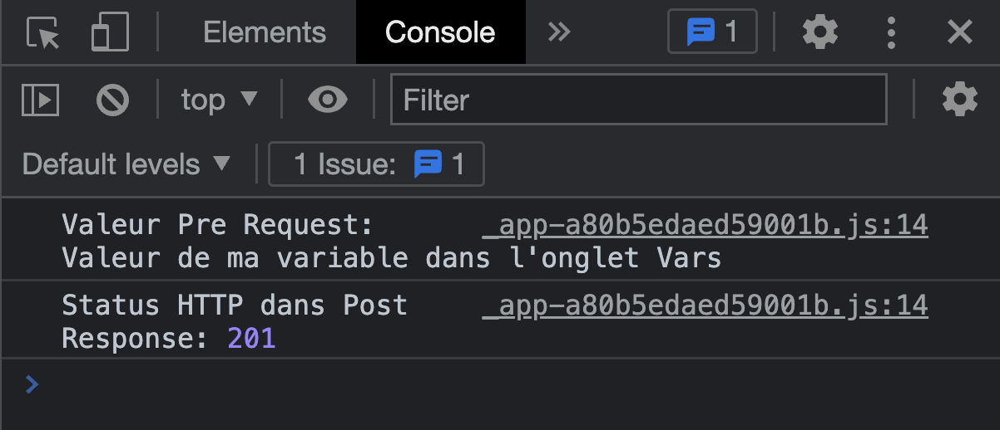

<script setup>
import Wars from '../components/Wars.vue';
import BattleInfo from '../components/BattleInfo.vue';
</script>

# Chapitre 5 - Les scripts à la rescousse 🚑
&nbsp;

#### Objectif de la Mission 🎯
- Découvrir les scripts dans Bruno
- Renforcer les rangs de la rébellion

## Pre Request scripts

Dans Bruno, via l'onglet "Script", il est possible d'écrire des scripts JS qui s'exécuteront __avant__ l'appel de la requête.

Dans ce script, est accessible, l'objet ```req``` représentant la requête HTTP faite au server (headers, url, ...). Pour plus d'info, vous pouvez vous rendre sur la [documentation de l'objet Request](https://docs.usebruno.com/scripting/request/request-object).




::: tip Pour ouvrir la console developpeur ℹ️
View > Toggle Developer Tools 
:::

Il est également possible de configurer, lire et modifier des variables qui seront accessibles au niveau de la requêtes et de la collection, pratique pour préparer le body d'une requête.

## Post Response scripts

Dans Bruno, via l'onglet "Script", il est également possible d'écrire des scripts JS qui s'exécuteront __après__ l'appel de la requête.

Dans ce script, est accessible, l'objet ```res``` représentant la réponse de l'appel HTTP fait au server. Cet objet peut être utilisé pour lire les valeurs du corps, des entêtes et du statut de la réponse. Pour plus d'info, vous pouvez vous rendre sur la [documentation de l'objet Response](https://docs.usebruno.com/scripting/response/response-object).




Il est également possible de configurer, lire et modifier des variables qui seront accessibles au niveau de la requêtes et de la collection, pratique pour sauvegarder le résultat ou partie d'une réponse pour une une autre requête de la collection.

## Variables de collection

Il est possible de configurer des variables de deux manières, programmatique et déclarative.

### Variables scriptées

Pour manipuler des variables de manière programmatiques, il faudra le faire dans les Pre Script et/ou Post Script via l'objet bru et son API ([documentation ici](https://docs.usebruno.com/scripting/javascript-reference#bru)).

// TODO --> Re faire des screens (sur grand écran pour avoir tout sur une ligne)




### Variables déclaratives

Pour manipuler des variables de manière déclarative, il faudra le faire dans l'onglet Vars:.



Bruno attend une valeur dans Pre Request alors que dans la partie Post Response c'est une expression, où l'objet ```res``` est directement accessible.



::: warning Attention aux conflits
L'onglet Vars est exécuté avant l'onglet Script, donc si vous manipulez des variables de même nom, la valeur configurée dans Vars sera écrasée par celle configurée dans Script.

Order d'exécution: Vars Pre Request > Script Pre Request > Vars Post Response > Script Post Response
:::

___A vous de jouer!___

- Stocker votre passeport galactique dans une variable galactic_passport
- Ajoutez une requête pour faire progresser un des types de personnage
  - cette requête nécessite votre passeport galactique
  - ce passeport est en réalité un Bearer Token 🤫, utilisez le pour vous identifier
    - dans l'onglet ```Headers```
    - ou dans l'onglet ```Auth``` en tant que ```Bearer Token```
  - utiliser votre variable galactic_passport

// TODO --> Clean des requêtes avec les console.log pour l'authent

::: tip Astuce
Pour vérifier si vos variables sont correctement configurées, vous pouvez faire un console.log ou cliquez sur l'icône en forme d'oeil en haut à droite de Bruno. Elle permet d'afficher les variables de collection et d'environnement.
:::

<Solution title="Besoin d'un coup de main ?">

Les solutions à ce chapitre sont dans les dossiers [solutions/chapter-5](https://github.com/aland404/workshop-bruno/tree/main/solutions/chapter-5) et [solutions/environments](https://github.com/aland404/workshop-bruno/tree/main/solutions/environments)

</Solution>

### Renforcer les rangs

Lorsqu'un personnage de l'empire progresse, sa puissance augmente de 10, alors que la puissance d'un personnage de la rébellion n'augmentera que de 1 (la côté obscure est séduisant...).

___Faites progresser les wookies pour gagner la bataille `Envahisseurs à Kashyyyk`___

<BattleInfo
    war-slug="client-api-war"
    battle-slug="kashyyyk-battle-1"
    displayAlone
/>

::: tip Info
Renforcer les rangs de la résitance en cliquant de manière effrénée est plutôt répétitif, long et contraignant... 😕

Il est possible d'exécuter en boucle les requêtes d'un dossier ou d'une collection depuis l'interface, cependant il faut posséder la version payante de Bruno. 
:::