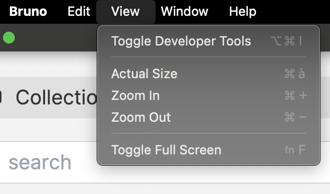
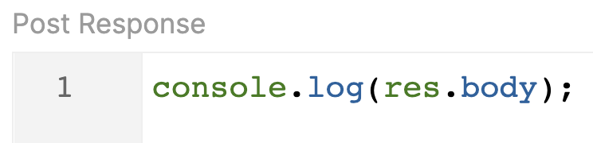

# Chapitre 5 - Les scripts à la rescousse 🚑
&nbsp;

#### Objectif de la Mission 🎯
- Découverte des scripts dans Bruno
- Découverte de l'utilisation de librairies
- Renforcer les rangs de la rébellion

## Pre Request scripts

Dans Bruno, via l'onglet "Script", il est possible d'écrire des scripts JS qui s'exécuteront __avant__ l'appel de la requête.

Dans ce script, est accessible, l'objet ```req``` représentant la requête HTTP faite au server (headers, url, ...). Pour plus d'info, vous pouvez vous rendre sur la [documentation de l'objet Request](https://docs.usebruno.com/scripting/request/request-object).


::: tip Pour ouvrir la console developpeur ℹ️
View > Toggle Developer Tools 
:::

Il est également possible de configurer, lire et modifier des variables qui seront accessibles au niveau de la requêtes et de la collection, pratique pour préparer le body d'une requête.

## Post Response scripts

Dans Bruno, via l'onglet "Script", il est également possible d'écrire des scripts JS qui s'exécuteront __après__ l'appel de la requête.

Dans ce script, est accessible, l'objet ```res``` représentant la réponse de l'appel HTTP fait au server. Cet objet peut être utilisé pour lire les valeurs du corps, des entêtes et du statut de la réponse. Pour plus d'info, vous pouvez vous rendre sur la [documentation de l'objet Response](https://docs.usebruno.com/scripting/response/response-object).




Il est également possible de configurer, lire et modifier des variables qui seront accessibles au niveau de la requêtes et de la collection, pratique pour sauvegarder le résultat ou partie d'une réponse pour une une autre requête de la collection.

## Variables

Il est possible de configurer des variables de deux manières, programmatique et déclarative.

### Variables programmatiques


### Variables déclaratives

## Lirairies

### Librairies intégrées

### Librairies externes