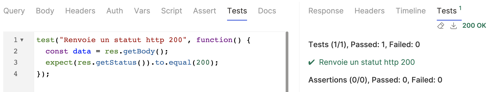

# Chapitre 6 - Renforcement de la sécurité 🥋
&nbsp;

#### Objectif de la Mission 🎯
- Découvrir les tests automatisés
- Découvrir Bruno CLI
- Préparer la victoire de la rébellion

## Tests automatisés

Bruno offre la possibilité d'écrire des tests d'automatisation.

À l'instar des variables de collection, il est possible de les déclarer de manière scriptée ou déclarative.

::: details Avantages des tests
- Efficacité accrue : les tests peuvent être exécutés à plusieurs reprises, réduisant ainsi le temps et les efforts requis pour les tests manuels.
- Couverture accrue : les tests automatisés peuvent couvrir un plus grand nombre de scénarios et de cas extrêmes par rapport aux tests manuels.
- Intégration continue/livraison continue (CI/CD) : les tests d'API automatisés peuvent être intégrés dans un pipeline CI/CD, garantissant que les modifications de l'API sont minutieusement testées avant le déploiement.
- Maintenance plus facile : les tests automatisés peuvent être facilement mis à jour à mesure que l'API évolue, réduisant ainsi la charge de maintenance par rapport aux tests manuels.
- Tests de régression plus faciles : les tests automatisés peuvent être facilement répétés une fois que des modifications ont été apportées à l'API, réduisant ainsi le temps requis pour les tests de régression.
:::


### Tests scriptés

Bruno prend en charge l'écriture de scripts de tests d'automatisation en JavaScript pour vos requêtes API afin d'affirmer leurs comportements (onglet Tests).

Bruno utilise la librairie d'assertion Chai ([documentation api](https://www.chaijs.com/api/bdd/)).

L'écriture d'un test se fait comme ceci:
``` js
// contenu de mon test
test("Intitulé de mon test, ce que je veux tester", function() {
  // contenu de mon test
  const data = res.getBody();
  // ce que je veux vérifier, ce à quoi je m'attends
  expect(res.getStatus()).to.equal(200);
});
```

Ajoutez l'exemple ci-dessus sur la requête de lecture de tous les personnages qui est censée renvoyée un statut http 200 (n'hésitez pas à modifier l'intitulé du test et supprimer les commentaires).

Si vous exécutez la requête, vous pourrez voir dans l'onglet `Tests` de la partie de droite le résultat de celui-ci (vert si réussi, rouge si échoué). 



### Tests déclaratifs

Les assertions vous permettent d'écrire des tests de manière déclarative (onglet `Assert`). L'objet `res` est directement accessible dans les expressions à vérifier (ex: res.body, res.status, ...).

Essayez de définir le même test que précédement mais de manière déclarative en rajoutant une expression dans l'onglet `Assert`.

Si vous exécutez la requête, vous pourrez voir dans l'onglet `Tests` de la partie de droite le résultat de votre test précédent et de votre nouvelle assertion.

Vous pouvez combiner les tests scriptés et déclaratifs. Les tests déclaratifs devraient couvrir la plupart de vos besoins en matière de tests mais pour les tests complexes, vous pouvez écrire des tests scriptés.

### __On nous a hacké! 🚨__

Les informateurs de la rébellion nous ont indiqué que l'empire était capable d'intercepter certains appels à l'API de la rébellion et de manipuler le retour de celles-ci. Il n'est donc plus possible de faire confiance à ces requêtes!

Heureusement leur hacking laisse des traces, et vous êtes capable d'identifier ces requêtes.

Pour cela il faut vérifier que:
- le statut http de la requête est différent de 666
- le type de retour est un objet ou une liste `(typeof value === 'object')`
- qu'aucun des champs d'un objet ou d'une liste d'objet ne contient `Vive l'empire!` (peut importe la casse)
- si un champ currentDate est renvoyé, il correspond à la date du jour au format dd/mm/yyy

Vous allez devoir ajouter ces vérifications pour toutes les requêtes de votre collection pour être sûr de vous.

Cela peut s'avérer long et répétitif, surtout si vous avez beaucoup de requêtes. Et si jamais une nouvelle vérification devait se rajouter, il faudrait la rajouter sur chaque requête.

Heureusement il est possible de définir des tests au niveau de la collection, tests qui seront exécutés avant chaque requête. Cependant il faudra nécessairement écrire des tests programatiques, ceci n'est pas possible avec les tests déclaratifs pour le moment.

Pour ce faire, faites un clic droit sur votre collection (ou clic sur les trois petits points ...) et cliquez sur `Settings`. Vous devriez alors reconnaître l'onglet `Tests`que vous commencez à connaître. Ecrivez ici des tests pour valider les quatres points ci-dessus vous assurant de la fiabilité des requêtes. Ces tests necessitent un peu de code, vous pouvez copier coller le code qu'avait préparé un de vos camarades techniciens.

<Solution title="le statut http de la requête est différent de 666">

``` js
test("Requête fiable: le statut http de la requête est différent de 666", function() {
  expect(res.status).to.not.equal(666);
});
```

</Solution>

<Solution title="le type de retour est un objet ou une liste">

``` js
test("Requête fiable: le type de retour est un objet ou une liste", function() {
  expect(typeof res.body === 'object').to.be.true
});
```

</Solution>

<Solution title="aucun champ ne contient 'Vive l'empire!'">

``` js
test("Requête fiable: aucun champ ne contient 'Vive l'empire!'", function() {
  const searchText = "Vive l'empire!";
  const result = containsText(res.body, searchText.toUpperCase());
  expect(result).to.be.false
});

function containsText(obj, text) {
  if (Array.isArray(obj)) {
    for (let item of obj) {
      if (containsText(item, text)) {
        return true;
      }
    }
  } else if (typeof obj === 'object' && obj !== null) {
    for (let key in obj) {
      if (obj.hasOwnProperty(key)) {
        if (containsText(obj[key], text)) {
          return true;
        }
      }
    }
  } else if (typeof obj === 'string') {
    if (obj.toUpperCase().includes(text)) {
      return true;
    }
  }
  return false;
}
```

</Solution>

<Solution title="currentDate est la date est la date du jour">

``` js
test("Requête fiable: la date est la date du jour", function() {
  const currentDate = getCurrentDateInBody()
  if(currentDate){
   expect(currentDate).to.equal(getCurrentDateFormatted())
  }
});

function getCurrentDateInBody() {
  if (Array.isArray(res.body)) {
      // Check each element in the array
      res.body.forEach(item => {
        if(item.currentDate) return item.currentDate
      })
  } else {
      // Check the body directly
      if(res.body.currentDate) return res.body.currentDate
  }
  
  return undefined
}

function getCurrentDateFormatted() {
  const today = new Date()
  const day = String(today.getDate()).padStart(2, '0')
  const month = String(today.getMonth() + 1).padStart(2, '0') // Les mois commencent à 0
  const year = today.getFullYear()

  return `${day}/${month}/${year}`
}
```

</Solution>

Maintenant si vous executez une requête de votre collection, celle-ci lancera tous ces tests.

Vous pouvez également lancer un ensemble de requêtes d'un coup, les requêtes d'un dossier ou d'une collection via un clic droit (ou les trois petits points...), puis `Run`, puis `Recursive run`.

Un onglet `Runner` s'ouvre alors avec l'ensemble des requêtes appelées et l'ensemble des tests exéctués pour chacune de ces requêtes.

// TODO: ajouter une image

Nous allons maintenant voir comment exécuter ces requêtes avec la CLI Bruno.

## Bruno CLI

[Documentation de la CLI Bruno](https://docs.usebruno.com/bru-cli/overview)

### Installation

```shell
yarn global add @usebruno/cli
#OR
npm install -g @usebruno/cli
#OR
pnpm add -g @usebruno/cli
```

### Executer une collection

Naviguez jusqu'au dossier où se trouve votre collection d'API puis lancez la commande:

```shell
bru run --env env_name # où env_name est le nom que vous avez donné à votre environnement
```

// TODO: ajouter une image

### Téléchargez une collection contenant des requêtes supplémentaires que vous n'avez pas encore

### Importez une collection qui contient des requêtes ainsi que des tests

### Lancez les tests pour toute cette collection depuis l'interface ou la CLI

### Supprimez celles corrompues par l'empire

### Allons gagner cette foutue guerre!

<Solution title="Besoin d'un coup de main ?">

Les solutions à ce chapitre sont dans les dossiers [solutions/chapter-6](https://github.com/aland404/workshop-bruno/tree/main/solutions/chapter-6) et [solutions/environments](https://github.com/aland404/workshop-bruno/tree/main/solutions/environments)

</Solution>

