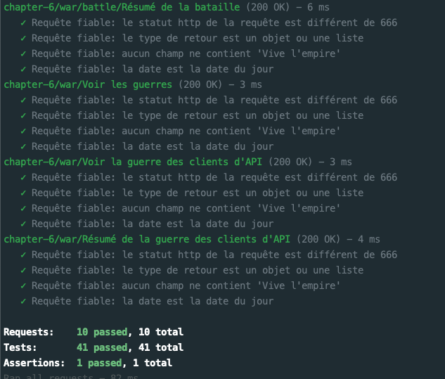
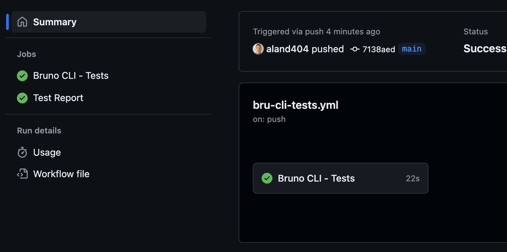
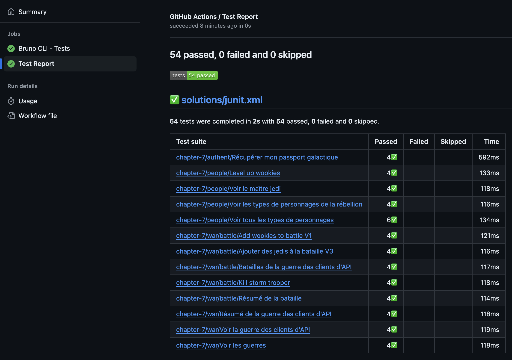

# Chapitre 7 - Le pouvoir de la CI 🤖⚡️
&nbsp;

#### Objectifs de la Mission 🎯
- Découvrir Bruno CLI
- Réussir l'intégration de Bruno dans une pipeline de delivery

## Bruno CLI

La Command Line Interface de Bruno permet d'exécuter une collection de requêtes.

[Documentation de la CLI Bruno](https://docs.usebruno.com/bru-cli/overview)

### Installation

```shell
yarn global add @usebruno/cli
#OR
npm install -g @usebruno/cli
#OR
pnpm add -g @usebruno/cli
```

### Executer une collection

Naviguez jusqu'au dossier où se trouve votre collection d'API Bruno puis lancez la commande:

```shell
# env_name est le nom que vous avez donné à votre environnement
# your_password est le mot de passe utilisé pour récupérer votre passport galactique
bru run --env env_name --env-var password=your_password
```

::: warning
Attention à bien vous positionner à la racine de votre collection Bruno, sinon la commande ne fonctionnera pas.

Bruno utilise un stockage sécurisé pour vos variables secrètes depuis l'interface utilisateur.
Pour pouvoir les utiliser depuis la CLI, vous devez les transmettre explicitement en tant que variable d'environnement.
:::

Toutes vos requêtes et les tests correspondants s'exécutent, vous devriez voir quelque chose comme ceci:



Maintenant que nous savons nous servir de la CLI Bruno, nous pouvons l'intégrer dans une pipeline de delivery.

## Intégration dans une pipeline de delivery

Il est possible d'intégrer une étape d'exécution d'une collection Bruno via n'importe quelle solution d'automatisation CI/CD.

Nous prendrons en exemple celle proposée par Github avec les Github Actions.

### Avec Github

<br/>

#### Pré-requis

Pour pouvoir réaliser cette partie, il est nécessaire d'avoir un compte Github.

<br/> 

#### Création d'un nouvel environnement

Pour exécuter une collection, il faut avoir accès à l'API web que nous souhaitons tester
- Github n'a pas accès à notre localhost
- l'API doit être exposée sur le net

Heureusement, un serveur distant est disponible :
- Créez un nouvel environnement Bruno nommé `Tatooine` qui sera le même que votre précédent environnement
- Valorisez la variable `base_url` avec `https://male-ofelia-caq-40-9e85a7e6.koyeb.app`

<br/> 

#### Création d'un repository Github

Créez un repository sur votre compte Github et déposez-y le dossier représentant votre collection Bruno.

`Add file` > `Upload files` > sélectionnez votre collection dans la fenêtre qui s'ouvre > `Commit Changes`

<br/> 

#### Configuration des variables secrètes

Les variables secrètes sont inaccessibles en dehors de l'interface graphique de Bruno
  - il faut les transmettre explicitement en tant que variable d'environnement à la CLI
  - il ne faut pas que ces variables soient en clair dans nos fichiers

Il va donc falloir créer une variable secrète dans Github :

- sur votre repository cliquez `Settings` > `Secrets and Variables` > `Actions` > `New Repository Secret`
- nommez votre variable `GALACTIC_PASSPORT_PASSWORD`
- valorisez-la avec le mot de passe utilisez pour appelez votre requête pour récupérer un passeport galactique

<br/> 

#### Création d'une Github Actions

Les workflows GitHub Actions sont définis dans des fichiers YAML, stockés dans le répertoire .github/workflows d'un repository.

- Créez un fichier `.github/workflows/bru-cli-tests.yml` à la racine de votre repository Github.
  - `Add file` > `Create new file` > collez directement le nom `.github/workflows/bru-cli-tests.yml`
  - OU
  - cliquez sur l'onglet `Actions` > `set up a workflow yourself`

Copiez/collez le contenu suivant dans votre fichier yml en prenant soin de remplacer les deux occurences `<<collection_folder_name>>` par le nom de votre dossier de votre collection

<Solution title="Github action yml pour exécuter une collection Bruno">

```yaml
name: Bru CLI Tests

# Déclenche le workflow manuellement avec une entrée 'build'
on:
  workflow_dispatch:
    inputs:
      build:
        description: 'Bru CLI - Tests'
        required: true
        default: 'true'
  # Déclenche le workflow sur un push vers la branche 'main'
  push:
    branches: [main]
  # Déclenche le workflow sur les événements de pull request spécifiés
  pull_request:
    types: [ opened, synchronize, reopened ]

# Définir les variables d'environnement globales
env:
  ENVIRONMENT: Tatooine
  PASSWORD: ${{ secrets.GALACTIC_PASSPORT_PASSWORD }}

# Définir les permissions nécessaires pour les tests unitaires
permissions:
  statuses: write
  checks: write
  contents: write
  pull-requests: write
  actions: write

# Définir le job de tests
jobs:
  test:
    name: Bruno CLI - Tests
    runs-on: ubuntu-latest

    steps:
      # Étape pour récupérer le code source du dépôt
      - name: Checkout
        uses: actions/checkout@v4

      # Étape pour configurer Node.js
      - name: Setup Node
        uses: actions/setup-node@v4
        with:
          node-version: 20

      # Étape pour installer Bru CLI globalement
      - name: Install Bru CLI
        run: npm install -g @usebruno/cli

      # Étape pour afficher la version de Bru CLI installée
      - name: Display Bru CLI Version
        run: bru --version

      # Étape pour exécuter les tests avec Bru CLI
      - name: Run tests
        run: |
          cd <<collection_folder_name>> # Remplacez <<collection_folder_name>> par le nom du dossier de votre collection
          bru run --env ${{ env.ENVIRONMENT }} --output junit.xml --format junit --env-var password=${{ env.PASSWORD }}

      # Étape pour publier le rapport de tests
      - name: Publish Test Report
        uses: dorny/test-reporter@v1
        if: success() || failure() # Exécuter cette étape si le job réussit ou échoue
        with:
          name: Test Report
          path: <<collection_folder_name>>/junit.xml # Remplacez <<collection_folder_name>> par le nom du dossier de votre collection
          reporter: java-junit

```

</Solution>

Cette Github Actions s'exécute à chaque commit sur main ou sur une pull request et peut également être déclenchée manuellement.

Vous devriez voir le résultat de votre Github Actions dans l'onglet `Actions` de votre repository.



Cliquez sur le `Job` nommé `Test Report` dans la partie gauche de l'écran pour voir le détail du rapport de l'exécution de vos requêtes.



Félicitations, vous avez créé votre première pipeline de delivery avec Bruno 🎉

Encore une dernière étape pour les plus téméraires.